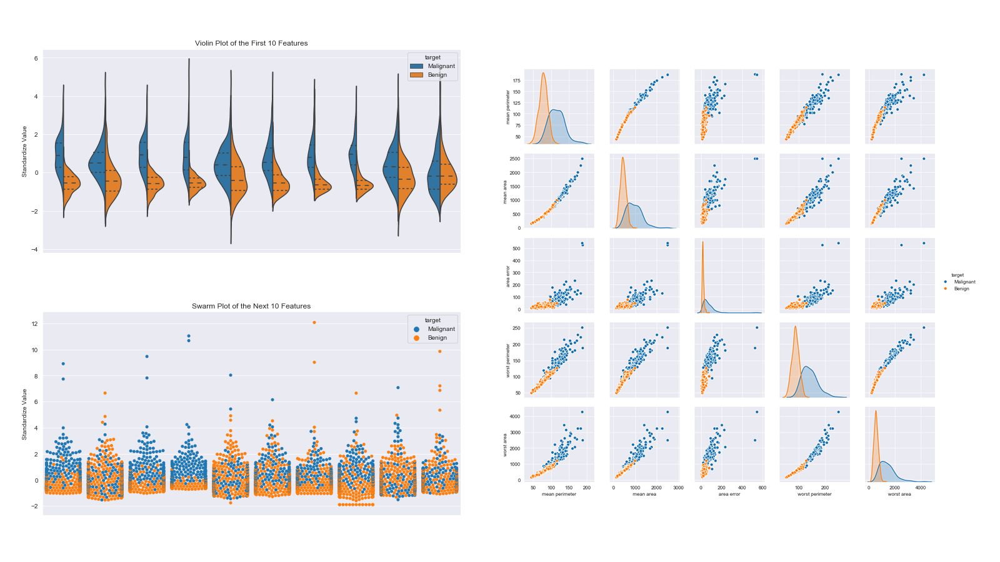

# Portfolio
---
## Credit card risk analysis

### Adaptive decision tree

I developed a custom decision tree algorithm to optimize profits on credit card chargeback data.  
By utilizing entropy to classify data at the early stages and maximizing profit gain at the terminal nodes, the adaptive decision tree improved the profits generated by the test samples. 
This project demonstrates how custom machine learning techniques can improve the solutions on business problems. 

### Adaptive random forest 

An adaptation for the adaptive decision tree, generating a tree ensemble to make better predictions.  
In comparison with the XGB model, after balancing the data by oversampling with Smote, the XGB predictions had a slightly worse profit performance, but higher F1, accuracy, recall and training speed.

---
## Property rental price analysis

Using some training data from Datacamp, in this notebook I do the ETL and the exploratory analysis on hotels and houses rental prices in San Francisco. 
Feature engineering region clusters and characteristics, I create a base model based on linear regression and compare with regression trees and XGB. 
To deeper understand the model's performance and what to expect from the model, I also plot the hotels on San Francisco's map to check how to improve the input data and model. 

---
## Data Analysis

## Brazilian election fraud analysis

In 2022 there was a big discussion about "fraud in Brazil's election". The claim was based on the fact that there was an imbalance in the number of voting sections with 0 votes on Bolsonaro (144 sections) and with 0 votes on Lula (5 sections) 
If the sampling from each voting section was random, the voting urns would approach a normal curve (CLT theorem). 
In my exploratory analysis, I find the reasons why this is possible by pointing the bias source on these sections.  
Below, you can find the link for the github notebook in Portuguese and the Medium article in English.

---

## Manhattan's tree species analysis

Visualizations of Manhattan's trees and quick analisys of which tree species would be better suited to be planted.

<!-- 
---
## Data Science

### Credit Risk Prediction Web App

After my team preprocessed a dataset of 10K credit applications and built machine learning models to predict credit default risk, I built an interactive user interface with Streamlit and hosted the web app on Heroku server.

 

 

---
### Kaggle Competition: Predict Ames House Price using Lasso, Ridge, XGBoost and LightGBM

I performed comprehensive EDA to understand important variables, handled missing values, outliers, performed feature engineering, and ensembled machine learning models to predict house prices. My best model had Mean Absolute Error (MAE) of 12293.919, ranking <b>95/15502</b>, approximately <b>top 0.6%</b> in the Kaggle leaderboard.

 

 

---
### Predict Breast Cancer with RF, PCA and SVM using Python

In this project I am going to perform comprehensive EDA on the breast cancer dataset, then transform the data using Principal Components Analysis (PCA) and use Support Vector Machine (SVM) model to predict whether a patient has breast cancer.

 

 

---
### Business Analytics Conference 2018: How is NYC's Government Using Money?

In three-month research and a two-day hackathon, I led a team of four students to discover insights from 6 million records of NYC and Boston government spending data sets and won runner-up prize for the best research poster out of 18 participating colleges.

 

 

---
## Filmed by me

Besides Data Science, I also have a great passion for photography and videography. Below is a list of films I documented to retain beautiful memories of places I traveled to and amazing people I met on the way.

 

- [Ada Von Weiss - You Regret (Winter at Niagara)](https://www.youtube.com/watch?v=-5esqvmPnHI)
- [The Weight We Carry is Love - TORONTO](https://www.youtube.com/watch?v=vfZwdEWgUPE)
- [In America - Boston 2017](https://www.youtube.com/watch?v=YdXufiebgyc)
- [In America - We Call This Place Our Home (Massachusetts)](https://www.youtube.com/watch?v=jzfcM_iO0FU)

---

© 2020 Khanh Tran. Powered by Jekyll and the Minimal Theme.
 -->
